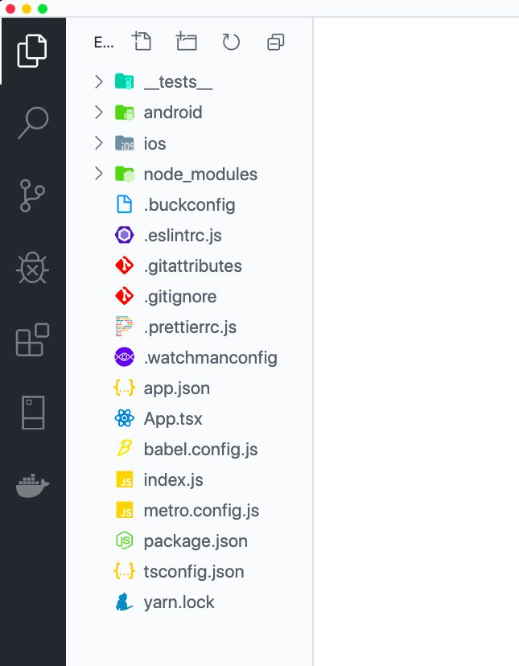
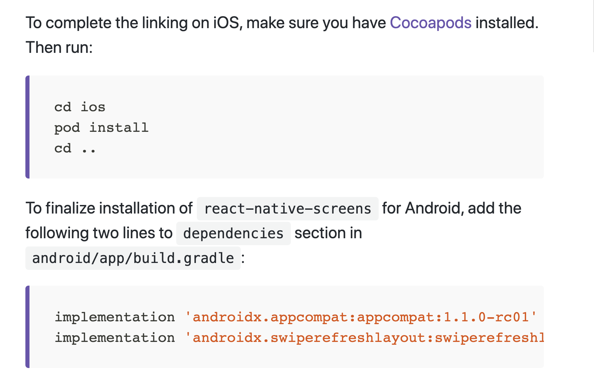
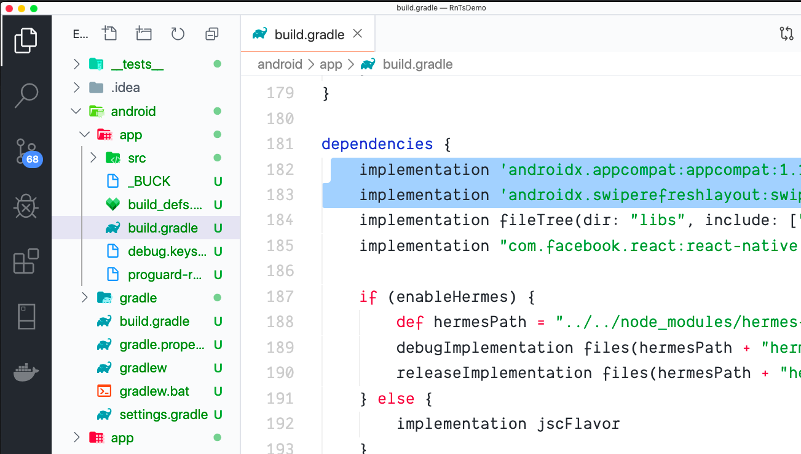
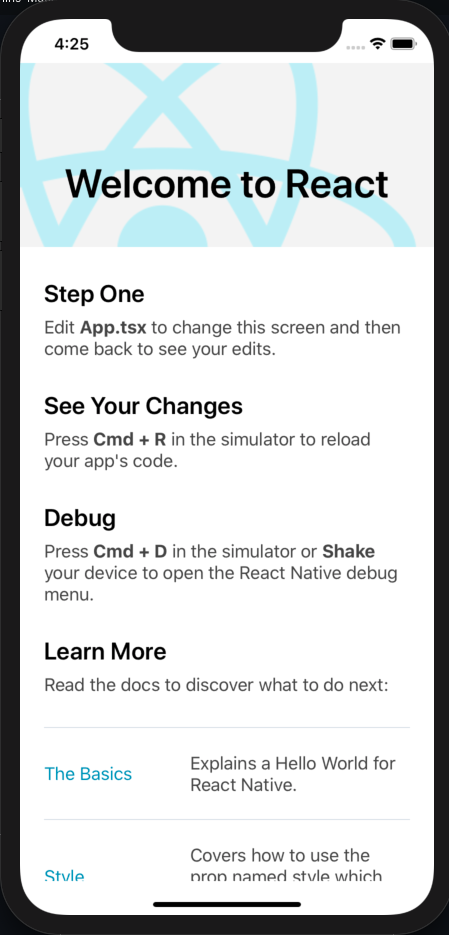
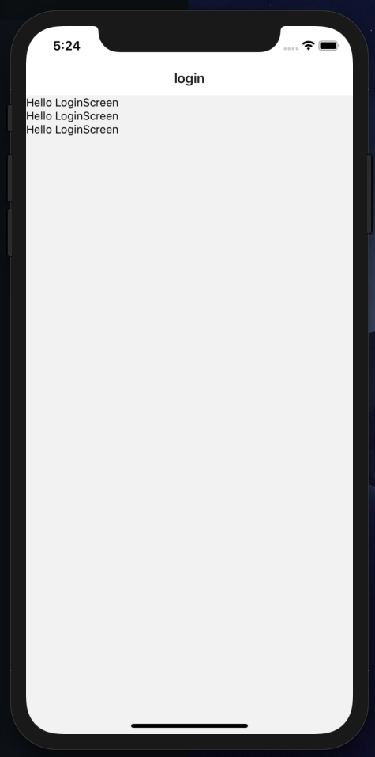

## React Native TypeScript and React Navigation vNext (5.0)

Let's create a React Native app with TypeScript and React Navigation vNext (5.0) by using the builder below.

####Requirements:
- [nodejs](https://nodejs.org/en/) (this includes NPM package manager)
- [vscode](https://code.visualstudio.com/)
- [yarn](https://yarnpkg.com/lang/en/) (optional NPM package manager)
- uninstall the legacy react-native-cli

```sh
$ npm uninstall -g react-native-cli
```
Then start creating a React Native in TypeScript project
```sh
$ npx react-native init MyRnProject --template react-native-template-typescript@latest
```

open the project on vscode using the command below
```sh
$ code MyRnProject
```


Install the packages below
```sh
$ npm install @react-navigation/native@next
$ npm install react-native-gesture-handler
$ npm install react-native-reanimated
$ npm install react-native-screens
$ npm install react-native-safe-area-context
$ npm install @react-navigation/stack
$ npm install @react-native-community/masked-view
```
additional configuration




To run the app
```sh
$ npm run android
```
or
```sh
$ npm run ios
```



create the directories and files below
- app/auth/LoginScreen.tsx
- app/navigation/root-navigation.tsx 

Just copy and paste the content of each file. Also edit the App.tsx


